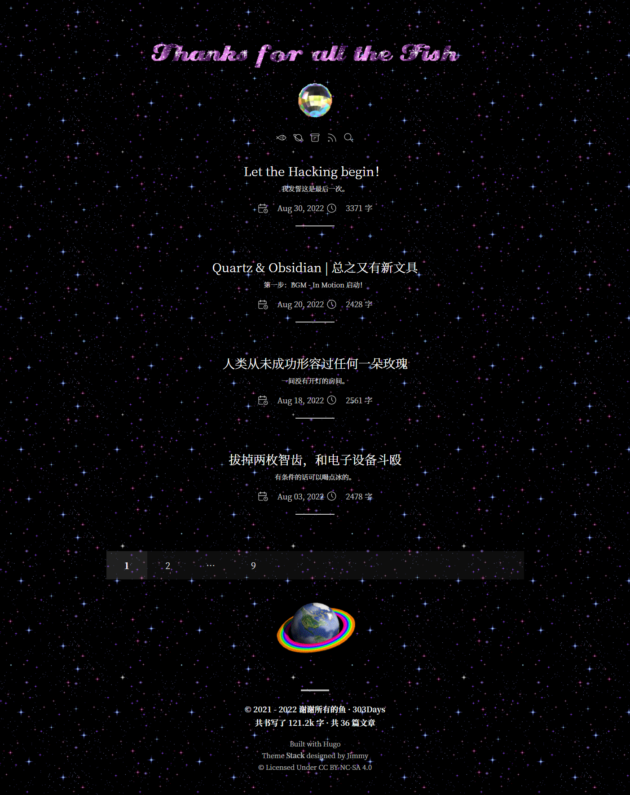
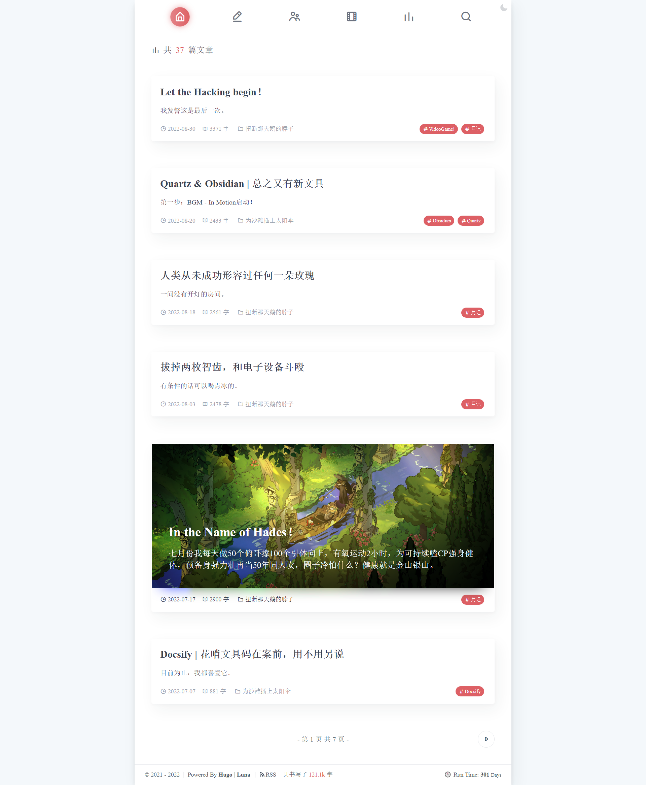

总之又换主题了！

旧的Luna主题漂亮美貌且功能齐全，可惜这主题用起来……确实问题很多且笨重。并且前段时间收到好几次站点打不开的反馈，我在Timeline上向黑客部门反馈了二十余次，无人应答，因此一直没有排查出问题，由于主站和子站点除了主题以外其他域名设置都是一致的，疑心是不是博客主题问题导致打不开，尽管我也觉得这怎么可能呢？再怎么怀疑也不应该怀疑到主题头上吧！

可是事情就是这么发生了，我的问题排查能力就是在这个水平了，再说了一个主题用久了就是很想换嘛！所以我决定换主题看看会不会有所改善。

不过在我在改主题的时随手查了一下邮箱，突然发现：

诶，哈哈哈，原来Vercel一直给我狂发邮件说我域名没设置好啊，一直以为是广告邮件……所以问题其实出在这里吧！！！

不过主题换都换了，本次改主题改得非常开心。请看：

 

找了一圈主题，最终还是选了功能齐全Stack（主要还是方便，因为之前就用过所以博客文件也还没删！），马上开始磨刀霍霍一顿乱改，把主题的层层叠叠的三栏结构改成了单栏，改的过程中忽然意识到人家本身就是美丽的层叠卡片式主题——我到底在干嘛啊！

总而言之，一股“我偏要勉强”的信念让我走到了现在。主要进行了以下修改：

1. 完全隐藏了左右边栏，站点信息转移到首页顶部。实现过程无限近似于搅拌浆糊，难以示人。
2. 站点名下的**灯球**点击后可以跳转到一个单独的 **[小猫页面](https://gregueria/home/)**！它其实是一个类似About的Page页，用`display: none;`隐藏掉了所有内容，然后在内容页用Html硬写出来的（使用`Ctrl+U`可以看见我写的垃圾代码）！
3. 增加了平铺的背景图片：闪，都给我闪jpg
4. 卡片改成了透明/半透明，轻薄透气感。外加黑色背景，酷，突出的就是一种酷。*啊？影响阅读？我才不管！*
5. 滚动条炫彩，我抄的。
6. 站点标题部分，由[Glittertextonline](http://www.glittertextonline.com/)自动生成。闪，都可以闪！
7. 各种灯球地球转来转去的图片来自：[Cinni](https://cinni.net/web.html#blinkies)。任谁看完都会很想抛弃极简主义写个古老风格的网页吧！

修改过程中最痛苦的地方其实是迁移文章，在之前的主题上使用了太多短代码，在新主题上频频报错，改得心烦意乱！讨厌欸！以后不用就是啦！

本次装修先告一段落，等忙完之后的装修计划：

- [ ] 写更可爱的博客首页！
- [ ] 写更可爱的独立Page！
- [ ] 写更可爱的文章页面！
- [ ] 增加更多更乱七八糟的可爱元素！

😚就这样！中秋快乐！